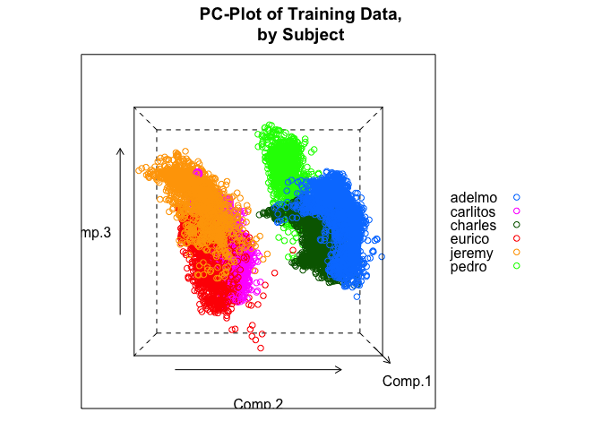

# Predicting Movement-Types:  Quick Model-Making with Random Forests
Homer White  
August 4, 2015  


## Overview

The project data is associated with the following study:

>Velloso, E.; Bulling, A.; Gellersen, H.; Ugulino, W.; Fuks, H.: *Qualitative Activity Recognition of Weight Lifting Exercises.* **Proceedings of 4th International Conference in Cooperation with SIGCHI** (Augmented Human '13) . Stuttgart, Germany: ACM SIGCHI, 2013.

Among other things, researchers were interested in using inertial measurement units (IMUs) to classify types of movement in human subjects.

The article describes a study involving six male subjects, all in their twenties..  Each subject was taught how to lift a dumb-bell correctly, and was also taught how to perform that same movement in four incorrect ways.  The five resulting categories were:

* A:  correct procedure;
* B:  throwing the elbows to the front;
* C:  lifting the dumbbell only halfway;
* D:  lowering the dumbbell only halfway;
* E:  throwing the hips to the front.

Each subject then performed ten repetitions of the lifting movement, in each of the five possible ways.  During each lift, the researchers recorded a number of inertial measurements:

>"For data recording we used four 9 degrees of freedom Razor inertial measurement units (IMU), which provide three-axes acceleration, gyroscope and magnetometer data at a joint sampling rate of 45 Hz. Each IMU also featured a Bluetooth module to stream the recorded data to a notebook running the Context Recognition Network Toolbox. We mounted the sensors in the users’ glove, armband, lumbar belt and dumbbell ... . We designed the tracking system to be as unobtrusive as possible, as these are all equipment commonly used by weight lifters."


Since there are six subjects, we have a total of 300 lifts.  However, during each lift the IMU measurements were gathered over a rolling series of time-windows, which over-lapped somewhat and which varied in length from 0.5 to 2.5 seconds.  This results in quite a few actual observations:  apparently a single observation in the data set corresponds to a specific time-window for a specific subject performing a lift in one of the specified ways.

The aim of this report is to devise a random forest model to predict activity-type from other variables in the data set.

## Data Processing

### Downloading

We download the main data. along with the examination data, from the web:


```r
wl <- read.csv("http://d396qusza40orc.cloudfront.net/predmachlearn/pml-training.csv",
                  stringsAsFactors = FALSE)
wl_test <- read.csv("http://d396qusza40orc.cloudfront.net/predmachlearn/pml-testing.csv",
                    stringsAsFactors = FALSE)
save(wl, file = "data/wl.rda")
save(wl_test, file = "data/wl_test.rda")
```


### A First Glance

The main data set consists of 19622 observations on 160 variables, including:

* a spurious row-number variable `X`;
* `user_name` (the name of the subject);
* three time-stamp variables;
* two variables, `new_window` and `num_window` related to time-windows;
* 152 numerical measurements derived from the IMUs;
* the variable `classe` that records the activity-type.


The examination set has 20 observations on the same first 159 variables as the main data, with the variable `problem_id` replacing `classe`.

### Elimination of Variables

A preliminary look at the 20 examination observations indicates that for many of the variables the values are altogether missing.  Although missing-ness may have predictive value, it is difficult to see how to take advantage of this fact, so we will simply exclude all such variables from our training data.  We will also exclude all variables that record time-stamps, and the useless row-number variable `X`.

Let us now consider the mysterious variables `new_window` and `num_window`.  Their nature is not clarified in the original article, so it is unclear whether they bear any material relationship to activity-type.  In fact, it appears that `num_window` is some sort of book-keeping variable.  For one thing, it consists entirely of integer values.  Secondly, if you split `num_window` by the values of `classe` and checks the resulting five vectors for intersections, you will see that they are mutually disjoint.  The following code confirms this:


```r
espl <- with(wl, split(num_window, f = classe))
for ( i in 1:4 ) {
  for ( j in (i+1):5) {
    set1 <- paste0("(window numbers for activity ", LETTERS[i],")")
    set2 <- paste0("(window numbers for activity ", LETTERS[j],")")
    result <- ifelse(length(intersect(espl[[i]], espl[[j]])) == 0, "empty", "nonempty")
    cat(paste0(set1, " intersect ", set2, " is ", result,"\n"))
  }
}
```

```
## (window numbers for activity A) intersect (window numbers for activity B) is empty
## (window numbers for activity A) intersect (window numbers for activity C) is empty
## (window numbers for activity A) intersect (window numbers for activity D) is empty
## (window numbers for activity A) intersect (window numbers for activity E) is empty
## (window numbers for activity B) intersect (window numbers for activity C) is empty
## (window numbers for activity B) intersect (window numbers for activity D) is empty
## (window numbers for activity B) intersect (window numbers for activity E) is empty
## (window numbers for activity C) intersect (window numbers for activity D) is empty
## (window numbers for activity C) intersect (window numbers for activity E) is empty
## (window numbers for activity D) intersect (window numbers for activity E) is empty
```

Hence it appears that `window_num` serves the researchers as some sort of conventional marker---perhaps for the lift that was being performed.  Any predictive value that is has---and it may have a lot, since `num_wondw` appears in the examination data---will be due to human convention only.  That value would evaporate in predictions for new data in which a different conventional book-marking scheme is used.

On similar grounds we exclude `new_window`.  We can't tell what it is, and it may very well be some other conventional marker.

We are ready to eliminate the spurious variables from our data frame.  The code for this is as follows:


```r
results_test <- sapply(wl_test, FUN = function(x) !all(is.na(x)))
goodNames <- names(results_test[results_test])
keepNames <- goodNames[-c(1,3,4,5,6,7,60)]
wl2 <- wl[,keepNames]
```

### The Issue of user_name

Note that we elected to retain `user_name`.  We offer two reasons for this choice:

1. The examination data consists of observations of the same six human subjects.  If the goal of the assignment were to predict well on new subjects, then the examination data would have been on new subjects.  Using the same subjects would make the examination artificially easy, even if the our model made no use of the `user_name` variable.
2. In practical applications it may very be the intention to train up a model on each new subject that one encounters, then let it predict future activities of *that same subject*.

### Conversion to Factors

We originally imported the data frame with the option `stingsAsFactors` set to `FALSE`.  For the sake of model-building later on, we now convert `classe` to a factor:


```r
wl2$user_name <- factor(wl2$user_name)
wl2$classe <- factor(wl$classe)
```

### Training and Test

Before we look into our training data, we need to divide it into a training set and a test set.  Since we do not intend to fit multiple models, we simply make a 60/40 split (training/test) using a command from the `caret` package, as follows:


```r
set.seed(3030)
trainIndex <- createDataPartition(y = wl2$classe, 
                                  p = 0.6, list = FALSE, times = 1)
wlTrain <- wl2[trainIndex, ]
wlTest <- wl2[-trainIndex, ]
```


## Descriptive Work

Now we delve a bit into the training set.  We begin by looking at the principal components (using commands from the excellent `FactoMineR` package):


```r
wl.pc <- PCA(wlTrain[, -c(1,2,54)], graph = FALSE)
kable(wl.pc$eig[1:10, 2:3])
```

           percentage of variance   cumulative percentage of variance
--------  -----------------------  ----------------------------------
comp 1                  16.039225                            16.03922
comp 2                  14.563636                            30.60286
comp 3                   9.162645                            39.76551
comp 4                   7.419774                            47.18528
comp 5                   6.157080                            53.34236
comp 6                   4.557330                            57.89969
comp 7                   4.133844                            62.03353
comp 8                   3.926445                            65.95998
comp 9                   3.370888                            69.33087
comp 10                  3.264287                            72.59515

Apparently the first five principal components account for a bit more than half of the variance in our numerical predictors.

The next plot shows some of the most important variables plotted against the first two principal components.  These variables would be the ones that are best at spreading out the data.  We would not be surprised later on to see some of them rated as important predictors of activity-type.


```r
plot(wl.pc, choix = "var", select = "cos2 5")
```

 


In the pre-processing stage we made the choice to retain `user_name` as a predictor variable.  The following two graphs (made with function `cloud()` from the `lattice` package) show two views of the cloud of training observations, plotted in terms of the first three principal components and color-coded by name of subject.


```r
Comp.1 <- wl.pc$ind$coord[,1]
Comp.2 <- wl.pc$ind$coord[,2]
Comp.3 <- wl.pc$ind$coord[,3]
cloud(Comp.1 ~ Comp.2 * Comp.3, groups = wlTrain$user_name,
      screen = list(x = 0, y = 0, z = 0),
      auto.key = list(space = "right"),
      main = "PC-Plot of Training Data,\nby Subject")
```

 


```r
cloud(Comp.1 ~ Comp.2 * Comp.3, groups = wlTrain$user_name,
      screen = list(x = 0, y = 90, z = 0),
      auto.key = list(space = "right"),
      main = "PC-Plot of Training Data,\nby Subject")
```

 


From the above plots we see that different subjects have distinct movement profiles---sometimes strikingly so.  From this I take two things:

1.  `user_name` may turn out to be a reasonably good useful predictor.
2.  If we have to predict activity for new subjects (i.e., people who were not in the study), then we cannot expect to do nearly as well as we would if we were to predict future activity for the only for the six subjects upon whom our model will be built.

## Model-Fitting

We will build a random forest prediction-model, and our intent will be to tune a particular parameter:  namely, the number of variables that the model chooses randomly when it has to decide how to split at any node in the construction of any one of its trees.  (In the `randomForest` package this number is known as `mtry`.)  We don't want our fitting-process to take too long, so we want to make our model using the smallest number of trees we can get away with.  Hence we build a "quickie" random forest with 500 trees, and `mtry` left at its default value (`floor(sqrt(55))`, or 7, in our case):


```r
set.seed(1010)
(rf.prelim <- randomForest(x = wlTrain[,1:53], y = wlTrain$classe,
                   do.trace = 50))
```

```
## ntree      OOB      1      2      3      4      5
##    50:   0.90%  0.27%  1.54%  1.12%  1.50%  0.46%
##   100:   0.78%  0.27%  1.10%  0.73%  1.87%  0.32%
##   150:   0.77%  0.21%  1.18%  0.83%  1.66%  0.37%
##   200:   0.73%  0.15%  0.97%  1.02%  1.55%  0.37%
##   250:   0.65%  0.15%  1.01%  0.78%  1.40%  0.28%
##   300:   0.70%  0.15%  0.97%  0.93%  1.50%  0.37%
##   350:   0.66%  0.15%  0.92%  0.88%  1.40%  0.32%
##   400:   0.59%  0.09%  0.83%  0.73%  1.35%  0.32%
##   450:   0.65%  0.09%  0.97%  0.78%  1.40%  0.37%
##   500:   0.68%  0.09%  0.97%  0.83%  1.45%  0.46%
```

```
## 
## Call:
##  randomForest(x = wlTrain[, 1:53], y = wlTrain$classe, do.trace = 50) 
##                Type of random forest: classification
##                      Number of trees: 500
## No. of variables tried at each split: 7
## 
##         OOB estimate of  error rate: 0.68%
## Confusion matrix:
##      A    B    C    D    E  class.error
## A 3345    2    1    0    0 0.0008960573
## B   14 2257    8    0    0 0.0096533567
## C    0   15 2037    2    0 0.0082765336
## D    0    0   25 1902    3 0.0145077720
## E    0    0    2    8 2155 0.0046189376
```


Good---that didn't take too long!  We note from the output that the random forest approach is liable to be impressive (our OOB error rate is only 0.68%), but our primary concern here is with the tree-building process itself.  We see that the OOB error estimates have pretty much stabilized by the time 300 trees are made, so in our actual model we will set `ntree` to 300.


The command below is from the `caret` package.  A few notes:

* for each of 10 values of `mtry` (as determined by the argument `tuneLength = 10`), we will construct a 300-tree random forest.
* For each forest, the prediction will be estimated in the usual "out-of-bag" way (setting `method = "oob"` in `trainControl()`).
* `allowParallel = TRUE` may make a difference on some machines.  (You must first install the `doParallel` package and choose the number of cores you plan to use.  Experiments with the aforementioned default random forest routine indicate that on my machine, a high-end Mac Book Pro, it makes no difference.)
* `importance = TRUE` permits us to make an importance plot later on.

>**Note to Evaluators:**  Although the assignment rubrics call for cross-validation to estimate error rates, out-of-bag estimates are perfectly fine for random forest models, and can be obtained much more quickly.  If that's a problem for you, then hang on to the end of the report.  I'll bring in some cross-validation then, when it makes sense to do so.


```r
set.seed(2020)
rf <- train(x = wlTrain[,1:53], y = wlTrain$classe, method = "rf", 
             trControl = trainControl(method = "oob"),
             allowParallel = TRUE, ntree = 300, 
             importance = TRUE, tuneLength = 10)
```

The routine took less than nine minutes to run.  Here are the results:


```r
rf
```

```
## Random Forest 
## 
## 11776 samples
##    53 predictor
##     5 classes: 'A', 'B', 'C', 'D', 'E' 
## 
## No pre-processing
## Resampling results across tuning parameters:
## 
##   mtry  Accuracy   Kappa    
##    2    0.9893852  0.9865720
##    7    0.9932914  0.9915141
##   13    0.9933764  0.9916215
##   19    0.9924423  0.9904398
##   24    0.9921875  0.9901170
##   30    0.9907439  0.9882910
##   36    0.9899796  0.9873243
##   41    0.9884511  0.9853903
##   47    0.9867527  0.9832415
##   53    0.9831861  0.9787273
## 
## Accuracy was used to select the optimal model using  the largest value.
## The final value used for the model was mtry = 13.
```

It appears that we'll be going with the model where the trees sampled 13 variables randomly at each node.  Let's see how well we do on the test set:


```r
preds <- predict(rf, newdata = wlTest[,1:53])
confusionMatrix(preds, wlTest$classe)
```

```
## Confusion Matrix and Statistics
## 
##           Reference
## Prediction    A    B    C    D    E
##          A 2230   12    0    0    0
##          B    1 1497   10    0    0
##          C    1    9 1355    5    0
##          D    0    0    3 1278    2
##          E    0    0    0    3 1440
## 
## Overall Statistics
##                                           
##                Accuracy : 0.9941          
##                  95% CI : (0.9922, 0.9957)
##     No Information Rate : 0.2845          
##     P-Value [Acc > NIR] : < 2.2e-16       
##                                           
##                   Kappa : 0.9926          
##  Mcnemar's Test P-Value : NA              
## 
## Statistics by Class:
## 
##                      Class: A Class: B Class: C Class: D Class: E
## Sensitivity            0.9991   0.9862   0.9905   0.9938   0.9986
## Specificity            0.9979   0.9983   0.9977   0.9992   0.9995
## Pos Pred Value         0.9946   0.9927   0.9891   0.9961   0.9979
## Neg Pred Value         0.9996   0.9967   0.9980   0.9988   0.9997
## Prevalence             0.2845   0.1935   0.1744   0.1639   0.1838
## Detection Rate         0.2842   0.1908   0.1727   0.1629   0.1835
## Detection Prevalence   0.2858   0.1922   0.1746   0.1635   0.1839
## Balanced Accuracy      0.9985   0.9922   0.9941   0.9965   0.9991
```


Only 47 misses in 7846 observations:  not too shabby.  (But remember that we are testing on the same subjects for which the model was trained.)

Let's now have  quick look at which predictor variables were judged to be the most important:


```r
rf.imp <- varImp(rf, scale = FALSE, type = 1)
plot(rf.imp, top = 10, main = "Variable-Importance Plot",
     xlab = "Importance (Mean Decrease in Accuracy)")
```

 

i don't know enough physics to know whether these results are surprising.  I am a bit surprised, though, that `user_name` did not make an appearance in the Top Ten.

## Final Testing

So our final model is estimated to be correct about 99.7% of the time, a good bit better than than than the 98% rate the authors reported for their own model.  If the model were used to predict the activity of *new* subjects, however, then I would not expect it to do nearly as well.  (In fact the article authors employed a leave-one-subject-out routine to estimate an accuracy-rate of only 78% for new subjects.)

The examination data is for the same six subjects, so I am hopeful that my model is good will earn a perfect score.

Let's see what happens.  First, we need to make the examination data have the same form as our training set:


```r
wl_test2 <- wl_test[, keepNames]
wl_test2$user_name <- factor(wl_test2$user_name)
```

Now we predict:


```r
examPreds <- predict(rf, newdata = wl_test2)
results <- matrix(examPreds, nrow = 1)
colnames(results) <- wl_test$problem_id
kable(results)
```


1    2    3    4    5    6    7    8    9    10   11   12   13   14   15   16   17   18   19   20 
---  ---  ---  ---  ---  ---  ---  ---  ---  ---  ---  ---  ---  ---  ---  ---  ---  ---  ---  ---
B    A    B    A    A    E    D    B    A    A    B    C    B    A    E    E    A    B    B    B  

Then we format our answers for submission:


```r
pml_write_files = function(x){
  n = length(x)
  for(i in 1:n){
    filename = paste0("answers/problem_id_",i,".txt")
    write.table(x[i],file=filename,quote=FALSE,row.names=FALSE,col.names=FALSE)
  }
}

pml_write_files(examPreds)
```


Finally, we submit.  Not surprisingly, all of my predictions turned out to be correct.

## New Subjects

But there is still a nagging question:

>How well would the model do if we had to predict on *new* subjects?

It's possible to get some purchase on this question if we use a special kind of cross-validation.  Here's our plan:

* Use all of our data (training and test combined).
* Divide it into six folds.  Each fold will contains all of the observations pertaining to a particular subject.
* For each subject, build a 300-tree random forest on the *other* five subjects, then test it on the fold for the subject.
* We will NOT use `user_name` to build our forests.
* We'll get six sets of error-rates.  These will give us some idea of how a model built on our six subjects might do for a new subject.

These are just intended to be rough estimates, so we won't invest the additional time to tune the `mtry` parameter in each tree.  (As we saw from the model results above, accuracies don't vary much with differing values of `mtry`.)

OK, let's implement the plan:


```r
set.seed(4040)
accuracies <- numeric(6)
subjects <- levels(wl2$user_name)
wl2$classe <- factor(wl2$classe)
for ( i in 1:6) {
  oneSubject <-wl2[wl2$user_name == subjects[i], ]
  otherSubjects <- wl2[wl2$user_name != subjects[i], ]
  forest <- randomForest(x = otherSubjects[, 2:53], y = otherSubjects$classe,
                               ntree = 300)
  preds <- predict(forest, newdata = oneSubject[, 2:53], type = "response")
  actuals <- oneSubject$classe
  accuracy <- mean(preds == actuals)
  accuracies[i] <- accuracy
}

df <- data.frame(subject = subjects, estimated.accuracy = accuracies)
df
```

```
##    subject estimated.accuracy
## 1   adelmo          0.1831963
## 2 carlitos          0.5118895
## 3  charles          0.5851244
## 4   eurico          0.1794788
## 5   jeremy          0.4779541
## 6    pedro          0.3260536
```

The results are positively hideous---much worse, in fact, than what the researchers got when they estimated new-subject error-rates for their model!  If one really plans to build a model for use on new subjects, then it would be worth tweaking the random-forest method, or perhaps we should consider new methods altogether.

## References and Remarks

* The source code for this document is the file `README.Rmd` in my GitHub repository:  <a href= "https://github.com/homerhanumat/WeightLifting" target = "_blank">https://github.com/homerhanumat/WeightLifting</a>.
* The HTML for this document can be read as a README in the repository, but since GitHub knows nothing of `knitr` it cannot produce figure captions or format my tables.  If you to see them, then download the file `README.html` and view it.
* A web-link to citation information for the original article is:  <a href = "http://groupware.les.inf.puc-rio.br/har" target = "_blank">http://groupware.les.inf.puc-rio.br/har</a>.
