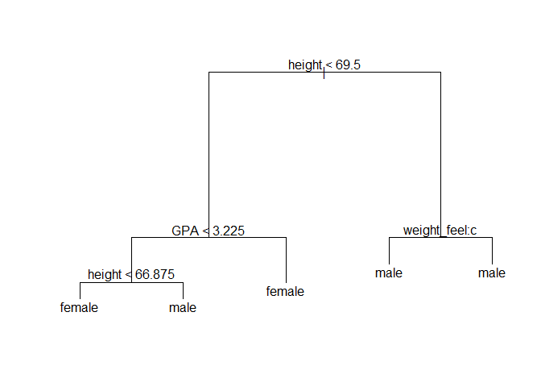

# Random Forest Section


### Classification Trees

Classification trees are a tree-based model and are used to predict a qualitative response. The variables that go into these classification trees can be numerical or categorical. We predict that "each observation belongs to the most commonly occuring class (or category) of training observations in the region to which it belongs" (James, 2013). They are useful because they provide predictors in situations where there are many variables that interact in complicated, non-linear ways. In interpreting these classification trees, we are often "interested in both the class prediction corresponding to a particular terminal node region, and in the class proportions among the training observations that fall into that region" (James, 2013). 

So, in simpler terms, a classification tree consists of a set of true/false decision rules. It is kind of like a game of 20 questions, where we ask different questions based on the answers to previous questions, and then at the end we make a guess based on all the answers. We can visualize a decision tree as a set of nodes (corresponding to true/false questions), each of which has two branches depending on the answer to the question. Unlike real trees, we usually draw them with their “root” at the top, and the “leaves” at the bottom. In order to make predictions with the tree, we start at the top (the “root” node), and ask questions, traveling left or right in the tree based on what the answer is (left for true and right for false). At each step, we reach a new node, with a new question. Once we reach the bottom (a leaf node), we make a prediction based on the set of answers, just like 20 questions. But unlike 20 questions, the number of questions in a decision tree is not always 20, but can vary (Corso, 2013). XXXXX**This was adapted from a lecture PPT of James Corso from SUNY at Buffalo CSE 555 course.**

Shall we look at an example of a classification tree?

We are using a data set from a survey taken in the MAT 111 class (Elementary Probability and Statistics). This data set has 71 rows and 12 variables. The survey includes variables such as sex, height, GPA, sleep, and the fastest speed ever driven. The names of some of the variables may seem a little odd, such as weight_feel, love_first, and  extra_life. The weight_feel variable is how the participant feels about their weight. They could have answered underweight ("a"), about right ("b"), or overweight ("c"). The love_feel variable is whether or not the participant believes in love at first sight and the extra_life variable is whether or not the participant believes in extraterrestrial life. The seat variable is where the participant sits in a classroom. The letter "a" corresponds to sitting in the front, "b" corresponds sitting in the middle rows, and "c" corresponds to sitting in the back rows.


```r
m111s.tr <- tree(sex~fastest+GPA+height+sleep+weight_feel+love_first,
                 data=m111survey)

summary(m111s.tr)
```

```
## 
## Classification tree:
## tree(formula = sex ~ fastest + GPA + height + sleep + weight_feel + 
##     love_first, data = m111survey)
## Variables actually used in tree construction:
## [1] "height"      "GPA"         "weight_feel"
## Number of terminal nodes:  5 
## Residual mean deviance:  0.4748 = 30.86 / 65 
## Misclassification error rate: 0.1143 = 8 / 70
```


This tree is used to predict the sex of an individual based on the variables of fastest speed ever driven, GPA, height, the amount of sleep the participant got the night before, how the participant feels about their weight, and if the participant believes in love at first sight. The summary given shows the variables actually used in constructing the classification tree, the number of terminal nodes, the residual mean deviance, and the misclassification error rate.


```r
plot(m111s.tr)
text(m111s.tr)
```

 

Looking at this tree, we can see that the first division is set when height is less than 69.5 inches. If the height of an observation is less than 69.5 inches they are put into the left region and those with a height equal to or above 69.5 inches are put into the right region. Those in the left hand region are divided by GPA. If the GPA is greater than or equal to 3.225, the prediction is female. If the GPA is less than 3.225, then a further division by height is made. If the height is less than 66.875 inches, then female is predicted. Otherwise, the sex is predicted as male. Those in the right region are divided by how they feel about their weight. Notice that the division is by "weight_feel:c". This means that the left region feel underweight or about right and the right region feel overweight. Instead of using the full name of the variable, this tree made shorter version. The letter "a" corresponds to feeling underweight, the letter "b" corresponds to feeling about right, and the letter "c" corresponds to feeling overweight. Looking at the two terminal nodes, it appears that it doesn't matter how they feel about their weight; the prediction will still be male. 

XXXXX **Ideally wants all girls or all guys at each node. "purity of node"- further sub-divide region into 2 where each was more purely guy or gal. Measure of avg purity. Deviance measure using example tree.**

As you can see from this example, classification trees are easy to interpret and fairly good predictions can be made from them. In this example the misclassification error rate is about 11.4%, or 8 out of 70 observations were misclassified.


### Random forests

Random forests are more advanced learning models that are capable of creating more complex decision boundaries than logistic regression.  The “forest” part of the name means that it is made up of multiple decision trees (in general, the more trees, the better). Usually in a random forest instead of building a tree using all the features, we use only a random subset of features and use bagging to create the trees. That means different trees will consider different features when asking questions. But in a forest, other trees would include this feature, so it would still influence the overall prediction by the random forest.

Random forests have low bias (just like individual decision trees), and by adding more trees, we reduce variance. 
XXXXX**Do I need to talk about variance and bias in this section?**

Here is an example of a random forest:


```r
set.seed(1010)
rf.sexm111 <- randomForest(sex~fastest+GPA+height+sleep+weight_feel+love_first+extra_life+ideal_ht+seat+enough_Sleep+diff.ideal.act., data=m111surv2, do.trace = 50)
```

```
## ntree      OOB      1      2
##    50:   5.88%  2.63% 10.00%
##   100:   4.41%  2.63%  6.67%
##   150:   4.41%  2.63%  6.67%
##   200:   4.41%  2.63%  6.67%
##   250:   4.41%  2.63%  6.67%
##   300:   4.41%  2.63%  6.67%
##   350:   4.41%  2.63%  6.67%
##   400:   4.41%  2.63%  6.67%
##   450:   4.41%  2.63%  6.67%
##   500:   4.41%  2.63%  6.67%
```

```r
rf.sexm111
```

```
## 
## Call:
##  randomForest(formula = sex ~ fastest + GPA + height + sleep +      weight_feel + love_first + extra_life + ideal_ht + seat +      enough_Sleep + diff.ideal.act., data = m111surv2, do.trace = 50) 
##                Type of random forest: classification
##                      Number of trees: 500
## No. of variables tried at each split: 3
## 
##         OOB estimate of  error rate: 4.41%
## Confusion matrix:
##        female male class.error
## female     37    1  0.02631579
## male        2   28  0.06666667
```


Now, we can look at individual trees from this forest to see the differences:


```r
getTree(rf.sexm111, k=1, labelVar = TRUE)
```

```
##    left daughter right daughter   split var split point status prediction
## 1              2              3         GPA       3.715      1       <NA>
## 2              4              5    ideal_ht      71.000      1       <NA>
## 3              0              0        <NA>       0.000     -1     female
## 4              6              7      height      66.875      1       <NA>
## 5              8              9      height      77.000      1       <NA>
## 6              0              0        <NA>       0.000     -1     female
## 7             10             11 weight_feel       1.000      1       <NA>
## 8              0              0        <NA>       0.000     -1       male
## 9             12             13 weight_feel       2.000      1       <NA>
## 10             0              0        <NA>       0.000     -1       male
## 11            14             15        seat       1.000      1       <NA>
## 12             0              0        <NA>       0.000     -1       male
## 13             0              0        <NA>       0.000     -1     female
## 14             0              0        <NA>       0.000     -1       male
## 15             0              0        <NA>       0.000     -1     female
```


```r
getTree(rf.sexm111, k=250, labelVar = TRUE)
```

```
##    left daughter right daughter       split var split point status
## 1              2              3          height      66.875      1
## 2              4              5        ideal_ht      72.500      1
## 3              6              7 diff.ideal.act.       1.750      1
## 4              0              0            <NA>       0.000     -1
## 5              0              0            <NA>       0.000     -1
## 6              8              9     weight_feel       1.000      1
## 7              0              0            <NA>       0.000     -1
## 8              0              0            <NA>       0.000     -1
## 9             10             11          height      72.500      1
## 10             0              0            <NA>       0.000     -1
## 11             0              0            <NA>       0.000     -1
##    prediction
## 1        <NA>
## 2        <NA>
## 3        <NA>
## 4      female
## 5        male
## 6        <NA>
## 7        male
## 8        male
## 9        <NA>
## 10     female
## 11       male
```


```r
getTree(rf.sexm111, k=499, labelVar = TRUE)
```

```
##    left daughter right daughter       split var split point status
## 1              2              3        ideal_ht       70.75      1
## 2              4              5      extra_life        1.00      1
## 3              6              7 diff.ideal.act.       -1.50      1
## 4              0              0            <NA>        0.00     -1
## 5              8              9         fastest       97.50      1
## 6              0              0            <NA>        0.00     -1
## 7              0              0            <NA>        0.00     -1
## 8              0              0            <NA>        0.00     -1
## 9             10             11            seat        2.00      1
## 10             0              0            <NA>        0.00     -1
## 11             0              0            <NA>        0.00     -1
##    prediction
## 1        <NA>
## 2        <NA>
## 3        <NA>
## 4      female
## 5        <NA>
## 6      female
## 7        male
## 8      female
## 9        <NA>
## 10       male
## 11     female
```


```r
getTree(rf.sexm111, k=96, labelVar = TRUE)
```

```
##    left daughter right daughter   split var split point status prediction
## 1              2              3         GPA      3.1335      1       <NA>
## 2              4              5       sleep      7.7500      1       <NA>
## 3              6              7 weight_feel      3.0000      1       <NA>
## 4              8              9       sleep      6.5000      1       <NA>
## 5             10             11       sleep      8.2500      1       <NA>
## 6             12             13    ideal_ht     70.0000      1       <NA>
## 7             14             15      height     72.0000      1       <NA>
## 8              0              0        <NA>      0.0000     -1       male
## 9             16             17        seat      3.0000      1       <NA>
## 10            18             19     fastest    115.0000      1       <NA>
## 11             0              0        <NA>      0.0000     -1     female
## 12             0              0        <NA>      0.0000     -1     female
## 13             0              0        <NA>      0.0000     -1       male
## 14             0              0        <NA>      0.0000     -1     female
## 15            20             21       sleep      6.0000      1       <NA>
## 16            22             23      height     64.8750      1       <NA>
## 17             0              0        <NA>      0.0000     -1     female
## 18             0              0        <NA>      0.0000     -1       male
## 19             0              0        <NA>      0.0000     -1     female
## 20             0              0        <NA>      0.0000     -1       male
## 21             0              0        <NA>      0.0000     -1     female
## 22             0              0        <NA>      0.0000     -1     female
## 23             0              0        <NA>      0.0000     -1       male
```


```r
getTree(rf.sexm111, k=153, labelVar = TRUE)
```

```
##    left daughter right daughter   split var split point status prediction
## 1              2              3         GPA        2.75      1       <NA>
## 2              4              5 weight_feel        3.00      1       <NA>
## 3              6              7    ideal_ht       71.00      1       <NA>
## 4              0              0        <NA>        0.00     -1       male
## 5              8              9        seat        1.00      1       <NA>
## 6              0              0        <NA>        0.00     -1     female
## 7             10             11      height       77.00      1       <NA>
## 8              0              0        <NA>        0.00     -1     female
## 9              0              0        <NA>        0.00     -1       male
## 10             0              0        <NA>        0.00     -1       male
## 11             0              0        <NA>        0.00     -1     female
```

XXXXX**Probably need to talk about what each tree means, since it is not in a neat visual form**
